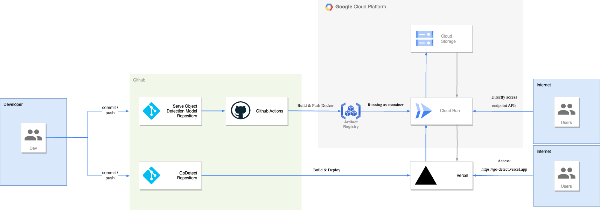
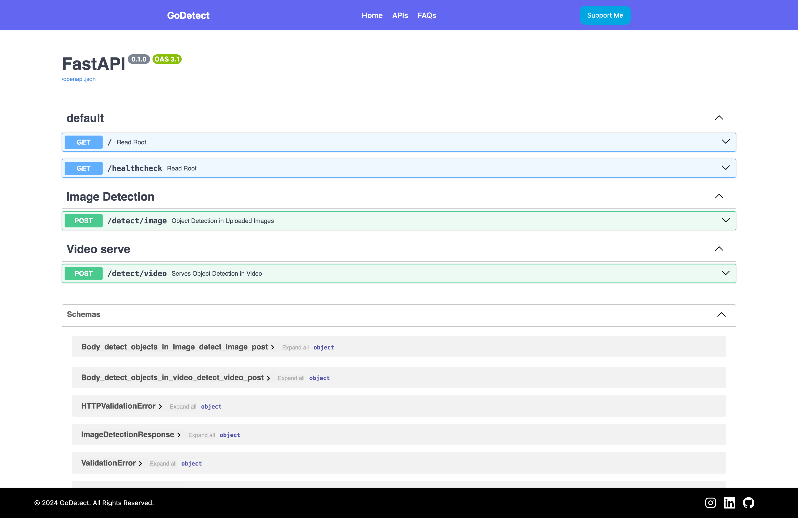
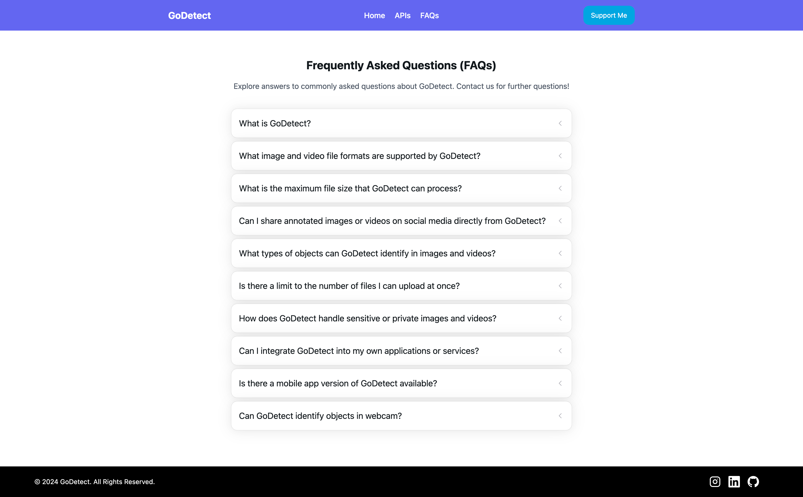

# GoDetect


GoDetect is a web application designed to perform object detection on user-provided image or video files. Users can upload their files, which will undergo object detection algorithms. The detected objects are then annotated, and the processed files are returned to the user. With GoDetect, users can easily identify and annotate objects in their media files, making it a versatile tool for various applications such as image analysis, content moderation, and more.

## Live Demo


[https://go-detect.vercel.app](https://go-detect.vercel.app)

## Tech Stack

- React 
- React Hook Form
- TailwindCSS
- Next UI
- Framer Motion

## Architecture Diagram

  

## Run Locally

Clone the project

```bash
  git clone https://github.com/fahmiam2/GoDetect
```

Go to the project directory

```bash
  cd GoDetect
```

Install dependencies

```bash
  npm install
```

Start the server

```bash
  npm run dev
```


## Running Tests

To run tests, run the following command

```bash
  npm run test
```

## Result

### Homepage


### APIs

  

### FAQs

  

### 404

  

Source illustration: [freepik](https://www.freepik.com/)


## Acknowledgements

 - [ReactJS Documentation](https://legacy.reactjs.org/docs/getting-started.html)
 - [Tailwind UI](https://tailwindui.com/documentation)
 - [Next UI Documentation](https://nextui.org/docs/guide/introduction)
 - [Vercel Deployment](https://vercel.com/docs)

### React + Vite

This template provides a minimal setup to get React working in Vite with HMR and some ESLint rules.

Currently, two official plugins are available:

- [@vitejs/plugin-react](https://github.com/vitejs/vite-plugin-react/blob/main/packages/plugin-react/README.md) uses [Babel](https://babeljs.io/) for Fast Refresh
- [@vitejs/plugin-react-swc](https://github.com/vitejs/vite-plugin-react-swc) uses [SWC](https://swc.rs/) for Fast Refresh


## Related

Here are some related projects

[Serve Object Detection](https://github.com/fahmiam2/serve-object-detection-restful-api)

